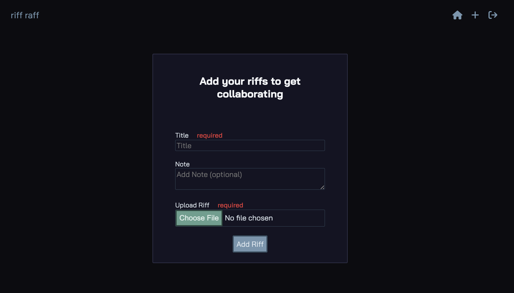

# Riff Raff

## Riff Raff at a Glance

Riff Raff is a full stack application that acts as a collections of pieces of songs, also known as riffs. With Riff Raff, users will be able to upload their own riffs to the community to collaborate with other users, or use their suggestions to help finish writing a song based on an individual riff. In order to listen to and comment on riffs, the user must be logged in. Once logged in, the user can upload their own riffs they've recorded. Any new riff uploaded will be added to the main feed. A logged in user can also leave comments on riffs. The comments will ideally serve to compliment the riff, add a suggested chord pattern to go over that riff, or a chord progression that would work for the next part in the song. Users are able to delete their own comments or riffs. A user's own comments are able to be updated if the user feels there's a better chord progression, or add more words of encouragement. A user's own riff titles and notes are also editable. There are currently 4 styles of music on display in the database, with a demo user available to browse all of the logged in features.

## <a href='https://riffraff.herokuapp.com/'>Riff Raff Live Demo </a>

### <a href='https://github.com/brianmay2014/riffraff/wiki'>Git Wiki</a>
 

## **_Home Page_**

 

## **_Riff Page_**
&emsp; The bread and butter of Riff Raff, all of the riffs are displayed for your listening and commenting pleasure.

 

## **_New Riff Page_**
&emsp;  This page is where the user will upload their own files via AWS to Riff Raff.

 

## Features
- Sign up / login with email.
- Logged in users can: 
    - Create new riff postings
    - Edit or delete their owned riffs
    - Leave comments on any riff
    - Edit or delete their own comments
- Logged out patrons:
    - Need to sign in for the so they can participate in the community Riff Raff
    - If they do not have an account, they'll need to become a user

## Getting Development Environment Up And Running
- Git Clone the repo to your local machine (latest main branch repo)
- Install Dependencies:
  - While inside `/app` Run:

         pipenv install --dev -r dev-requirements.txt && pipenv install -r requirements.txt
  
  - While inside `/react-app` Run

         npm install

- Create a '.env' file that mirrors the '.env.example' file
- Create a user in your local postgreSQL database according to the .env file
- Get into the virtual environment, migrate and seed your data base

         
         pipenv shell
         flask db upgrade
         flask seed all
         

- Start servers:
  - While inside `/app` Run `pipenv shell` to get inside the virtual environment then run `flask run` to get the backend server running.
  - While inside `/react-app` Run `npm start`
- Enjoy.

## Heroku Deployment
1. Create a Heroku account if you don't have one already
2. Create a new application in the dashboard, for example "my-Riff-Raff"
3. Under the "Resources" tab, click "Find More add-ons", and add "Heroku Postgres"
4. Install <a href='https://devcenter.heroku.com/articles/heroku-cli'>Heroku CLI</a>
5. Login to Heroku by running this in the terminal `heroku login`
6. When you're logged in, run `heroku authorizations:create`, and copy the GUID value for the Token key. 
7. The repo is set up with Github Actions, you'll need to set up two environment variables set up in your repo settings -> secrets -> actions. Click "New repository secret" to create these two variables:
   - `HEROKU_API_KEY` => set equal to the auth token from step 6.
   - `HEROKU_APP_NAME` => set equal to the Heroku app name you gave in step 2.
8. Back in Heroku, inside the "Settings" page of your newly created app, click on "Reveal Config Vars", and add the variables from the .env file for Heroku.
9. Whenever you push to the main branch, your Docker image will deploy the application to Heroku.
10. To seed the Heroku database, run `heroku run -a HEROKU_APP_NAME flask seed all`

## Application Architecture

Riff Raff is built on React and Redux in the frontend with a Flask backend, using PostgreSQL as a database.

## Frontend Overview

Riff Raff depends on backend for queries, routes, and most validations but uses the Redux store and React components for a snappy frontend.

 

### Frontend Technologies Used

#### React

Web pages of Riff Raff are rendered using React components. It creates dynamic reusable content, with quick DOM manipulation for fast re-rendering. Used React to build JSX elements.

#### Redux

Riff Raff uses Redux throughout to make limited backend calls for each page, and uses the Redux store to make re-renders quick whenever the store updates.

#### CSS

Riff Raff uses CSS to style all of the HTML documents.

#### Javascript

Javascript is used on the frontend with React and Redux to create a responsive app.

 

### Backend Overview

Riff Raff uses a Flask back-end server with PostgreSQL database. Riff Raff also implemented features to protect user's password and information.

#### Flask

The back-end server of Riff Raff is set up using Flask with Python.

#### WTForms

WTForms is utilized for back-end validation for all forms on the app.

#### PostgreSQL

Riff Raff relies on PostgreSQL to maintain its relational database.

#### AWS

Riff Raff uses AWS for file uploads to make adding a riff to the community easy to do right from the user's computer.

 

## Challenges and Solutions

- Waveform display
  - Originally there would be waveforms displaying for each riff, but I ran into multiple issues with getting them to display properly.
  - I tried with various packages, and got the furthest with the wavesurer.js package thanks to the more in-depth documentation.
  - The other packages I tried gave me issues with CORS, and I couldn't get much further than that due to abbreviated documentation.
  - With wavesurfer.js I tried all sorts of properties, and isolated loading for each waveform, but could not get the package to display any variance in the bar height, so I had to scrap that aspect to work on fixing bugs and cleaning up the rest of the project.
- Validations
   - As I was running through all the validations for the features I found some bugs with how the errors were being processed on the front ends.
   - It took unifying the back end response to make the front end components easier to display the errors.
   - Different inputs required different displays for errors. Most of the errors were able to be displayed right inside the form, but I wanted the comment form to be minimalist. To handle that I just had a little div show up underneath if any errors came from the back end, to keep a slim profile on that aspect of each riff card.

## Conclusion and Next Steps

The next step for Riff Raff is to add likes, user profiles, following (with a following only feed), and tags to search for riffs by their corresponding tags.
 
 
For any questions about any instructions, features, or any requested features, send me an e-mail at <a href='mailto:brianmay2014@gmail.com'>brianmay2014@gmail.com</a>, and I'll get back to you as quick as I can!

Thanks,
Brian May